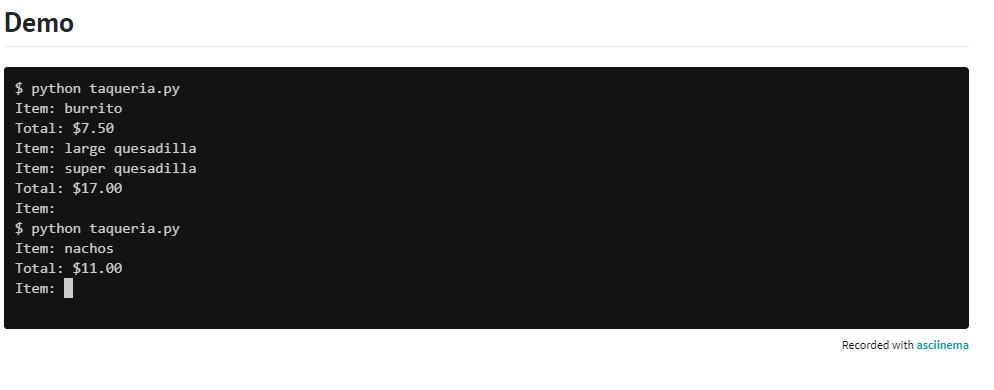

# PSet3
From Harvard cs50 assignments.

# Lesson Plan for Fuel Gauge
 

 Fuel gauges indicate, often with fractions, just how much fuel is in a tank. For instance 1/4 indicates that a tank is 25% full, 1/2 indicates that a tank is 50% full, and 3/4 indicates that a tank is 75% full.

In a file called fuel.py, implement a program that prompts the user for a fraction, formatted as X/Y, wherein each of X and Y is an integer, and then outputs, as a percentage rounded to the nearest integer, how much fuel is in the tank. If, though, 1% or less remains, output E instead to indicate that the tank is essentially empty. And if 99% or more remains, output F instead to indicate that the tank is essentially full.

If, though, X or Y is not an integer, X is greater than Y, or Y is 0, instead prompt the user again. (It is not necessary for Y to be 4.) Be sure to catch any exceptions like ValueError or ZeroDivisionError.

## Hints

* Recall that a str comes with quite a few methods, per docs.python.org/3/library/stdtypes.html#string-methods, including split.

* Note that you can handle two exceptions separately with code like:

    try:
      ...
  except ValueError:
      ...
  except ZeroDivisionError:
      ...

  Or you can handle two exceptions together with code like:

    try:
      ...
    except (ValueError, ZeroDivisionError):
      ...
## Demo

  

  

## How to Test

Here’s how to test your code manually:

* Run your program with python fuel.py. Type 3/4 and press Enter. Your program should output:
  75% 
* Run your program with python fuel.py. Type 1/4 and press Enter. Your program should output:
  25%
* Run your program with python fuel.py. Type 4/4 and press Enter. Your program should output:
  F
* Run your program with python fuel.py. Type 0/4 and press Enter. Your program should output:
  E
* Run your program with python fuel.py. Type 4/0 and press Enter. Your program should handle a ZeroDivisionError and prompt the user again.

* Run your program with python fuel.py. Type three/four and press Enter. Your program should handle a ValueError and prompt the user again.

* Run your program with python fuel.py. Type 1.5/3 and press Enter. Your program should handle a ValueError and prompt the user again.

* Run your program with python fuel.py. Type 5/4 and press Enter. Your program should prompt the user again.

# Lesson Plan for Felipe's Taqueria
  

One of the most popular places to eat in Harvard Square is Felipe’s Taqueria, which offers a menu of entrees, per the dict below, wherein the value of each key is a price in dollars:

  {
      "Baja Taco": 4.00,
      "Burrito": 7.50,
      "Bowl": 8.50,
      "Nachos": 11.00,
      "Quesadilla": 8.50,
      "Super Burrito": 8.50,
      "Super Quesadilla": 9.50,
      "Taco": 3.00,
      "Tortilla Salad": 8.00
  }
In a file called taqueria.py, implement a program that enables a user to place an order, prompting them for items, one per line, until the user inputs control-d (which is a common way of ending one’s input to a program). After each inputted item, display the total cost of all items inputted thus far, prefixed with a dollar sign ($) and formatted to two decimal places. Treat the user’s input case insensitively. Ignore any input that isn’t an item. Assume that every item on the menu will be titlecased.

## Hints

* Note that you can detect when the user has inputted control-d by catching an EOFError with code like:
    try:
      item = input()
    except EOFError:
      ...
  You might want to print a new line so that the user’s cursor (and subsequent prompt) doesn’t remain on the same line as your program’s 
  own prompt.
* Inputting control-d does not require inputting Enter as well, and so the user’s cursor (and subsequent prompt) might thus remain on the same line as your program’s own prompt. You can move the user’s cursor to a new line by printing \n yourself!
  
* Note that a dict comes with quite a few methods, per docs.python.org/3/library/stdtypes.html#mapping-types-dict, among them get, and supports operations like:
  d[key]
  and
  if key in d:
    ...
  wherein d is a dict and key is a str.
  
* Be sure to avoid or catch any KeyError.

## Demo

  

  

## How to Test
Here’s how to test your code manually:

* Run your program with python taqueria.py. Type Taco and press Enter, then type Taco again and press Enter. Your program should output:
  Total: $6.00
  and continue prompting the user until they input control-d.
* Run your program with python taqueria.py. Type Baja Taco and press Enter, then type Tortilla Salad and press enter. Your program should output:
  Total: $12.00
  and continue prompting the user until they input control-d.
* Run your program with python taqueria.py. Type Burger and press Enter. Your program should reprompt the user.

* Be sure to try other foods and vary the casing of your input. Your program should behave as expected, case-insensitively.

# Lesson Plan for Grocery List

Suppose that you’re in the habit of making a list of items you need from the grocery store.

In a file called grocery.py, implement a program that prompts the user for items, one per line, until the user inputs control-d (which is a common way of ending one’s input to a program). Then output the user’s grocery list in all uppercase, sorted alphabetically by item, prefixing each line with the number of times the user inputted that item. No need to pluralize the items. Treat the user’s input case-insensitively.

## Hints

* Note that you can detect when the user has inputted control-d by catching an EOFError with code like:
  try:
    item = input()
  except EOFError:
    ...
* Odds are you’ll want to store your grocery list as a dict.

* Note that a dict comes with quite a few methods, per docs.python.org/3/library/stdtypes.html#mapping-types-dict, among them get, and 
  supports operations like:
  d[key]
  and
  if key in d:
    ...
  wherein d is a dict and key is a str.
* Be sure to avoid or catch any KeyError.

## Demo

  

  

  

  

## How to Test
Here’s how to test your code manually:

* Run your program with python grocery.py. Type mango and press Enter, then type strawberry and press Enter, followed by control-d. Your   program should output:
  1 MANGO
  1 STRAWBERRY
* Run your program with python grocery.py. Type milk and press Enter, then type milk again and press Enter, followed by control-d. Your    program should output:
  2 MILK
* Run your program with python grocery.py. Type tortilla and press Enter, then type sweet potato and press Enter, followed by control-d.   Your program should output:
  1 SWEET POTATO
  1 TORTILLA

# Lesson Plan for Outdated

In the United States, dates are typically formatted in month-day-year order (MM/DD/YYYY), otherwise known as middle-endian order, which is arguably bad design. Dates in that format can’t be easily sorted because the date’s year comes last instead of first. Try sorting, for instance, 2/2/1800, 3/3/1900, and 1/1/2000 chronologically in any program (e.g., a spreadsheet). Dates in that format are also ambiguous. Harvard was founded on September 8, 1636, but 9/8/1636 could also be interpreted as August 9, 1636!

Fortunately, computers tend to use ISO 8601, an international standard that prescribes that dates should be formatted in year-month-day (YYYY-MM-DD) order, no matter the country, formatting years with four digits, months with two digits, and days with two digits, “padding” each with leading zeroes as needed.

In a file called outdated.py, implement a program that prompts the user for a date, anno Domini, in month-day-year order, formatted like 9/8/1636 or September 8, 1636, wherein the month in the latter might be any of the values in the list below:

 [
      "January",
      "February",
      "March",
      "April",
      "May",
      "June",
      "July",
      "August",
      "September",
      "October",
      "November",
      "December"
 ]

 Then output that same date in YYYY-MM-DD format. If the user’s input is not a valid date in either format, prompt the user again.   
 Assume that every month has no more than 31 days; no need to validate whether a month has 28, 29, 30, or 31 days.
 
## Hints
* Recall that a str comes with quite a few methods, per docs.python.org/3/library/stdtypes.html#string-methods, including split.

* Recall that a list comes with quite a few methods, per docs.python.org/3/tutorial/datastructures.html#more-on-lists, among which is index.

* Note that you can format an int with leading zeroes with code like
  print(f"{n:02}")
  wherein, if n is a single digit, it will be prefixed with one 0, per docs.python.org/3/library/string.html#format-string-syntax.

## Demo

  

  

    

## How to Test

Here’s how to test your code manually:

* Run your program with python outdated.py. Type 9/8/1636 and press Enter. Your program should output:
  1636-09-08
* Run your program with python outdated.py. Type September 8, 1636 and press Enter. Your program should output:
  1636-09-08
* Run your program with python outdated.py. Type 23/6/1912 and press Enter. Your program should reprompt the user.

* Run your program with python outdated.py. Type December 80, 1980 and press Enter. Your program should reprompt the user.
